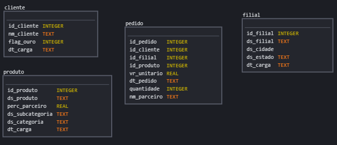
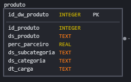
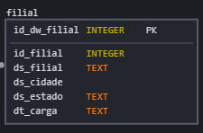
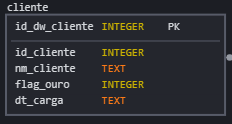
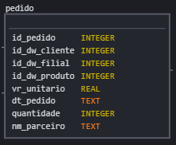

# Magalu


Para simular o ETL, precisei pensar numa forma de simular algum tipo de arquitetura, então usei SQLITE para simular o banco de dados transacional e o data warehouse.
Escolhi SQLITE pois é de fácil uso e não exige um arquitetura completa, o que para o desafio é uma otima opção.

## Transacional: 

[gerar_simulucao_db_transacional](https://github.com/dcarve/magalu/tree/main/gerar_simulucao_db_transacional)


Em [__ init __.py ](https://github.com/dcarve/magalu/blob/main/gerar_simulucao_db_transacional/__init__.py), o codigo lê os arquivos [create_tables.sql](https://github.com/dcarve/magalu/blob/main/gerar_simulucao_db_transacional/create_tables.sql) e [delete_tables.sql](https://github.com/dcarve/magalu/blob/main/gerar_simulucao_db_transacional/delete_tables.sql) para deletar (caso existam as tabelas) e para criar.
o código para deletar é apenas para facilitar o debug do código, ele pode ser retirado do código.

o código gera o seguinte arquivo sqlite gerar_simulucao_db_transacional/vendas.db

Precisei fazer uma alteração no tipo de dados de pedido.dt_pedido para string (text),  porque sqlite não suporta date, datetime e timestamp.

O código também usar os arquivos csv com os dados que foram disponibilizados e insere no bando de dados sqlite,  o diretório dos arquivos csv é [gerar_simulucao_db_transacional/data](https://github.com/dcarve/magalu/tree/main/gerar_simulucao_db_transacional/data)

OBS: 
O arquivo subcategoria.csv renomei para sub_categoria.csv, apenas para facilitar o código que cria o db transacional

Quanto ao  arquivo item_pedido.csv
removi as seguintes tuplas (linhas), porque para essas tuplas os valores de id_pedido não existem no arquivo pedido.csv, gerando assim uma violação de chave.
Devido a caracteristicas dos bando de dados considerarei que foi um erro.
Em uma situação real, iria entrar em contato com a área responsável, e apontar que há um problema no bando de dados e que a tabela item_pedido não foi criada com uma Foreing Key em id_pedido.

|id_pedido|id_produto|quantidade|vr_unitario|
|---|---|---|---|
|49380480716|4102853|1|90.87|
|49373493516|1822668|2|37.41|
|49373493516|1873163|1|68.63|
|4942505805|4350055|1|21.97|
|49390884213|3204711|1|220.99|
|49370834016|4617321|1|45.49|
|4937222026|3745861|1|467.87|
|9388745716|1596770|1|168.99|
|9372492013|1738325|1|84.49|
|49394876213|4345499|1|233.99|
|49394876213|3275155|1|232.7|
|49434582513|1652034|1|29.89|
|49392532713|1602865|1|311.99|
|49395367016|1846818|1|48.09|
|49451473516|1704469|1|77.99|
|49392006213|3439163|1|123.49|
|49392006213|4801826|1|103.99|
|49371186516|768880|1|31.19|
|49434996213|2278401|1|142.99|
|9377080716|3750522|1|53.29|
|9377042016|920747|1|142.99|
|9381329213|2233007|1|232.7|
|9375455013|2689982|1|220.99|
|9375754016|3258479|1|64.99|
|9372898516|1774043|1|155.99|
|9373114013|2699600|1|128.69|
|49373114013|1004297|1|129.99|
|49373114013|724166|1|103.99|
|49392734713|4066006|1|259.99|
|49373670013|2486675|1|45.49|
|49393120713|3806899|1|149.49|
|9394085016|4587161|1|97.4|


<br>
## data warehouse

[gerar_simulacao_data_warehouse/__ init __.py](https://github.com/dcarve/magalu/blob/main/gerar_simulacao_data_warehouse/__init__.py)




Para o data Warehouse, escolhe o modelo estrela, um fato (PEDIDO) e três dimensões (FILIAL, CLIENTE, PRODUTO), 
juntei os dados de categoria e subcategoria com produto, e cidade e estado com filial, item_pedido e parceiro juntei com pedido, quanto a cliente, não fiz alterações.
<br>

### PRODUTO (categoria, subcategoria, produto)



Os dados de categoria e subcategoria são dados categoricos de negócio, que provavelmente estão disponiveis por completo em outras plataformas ou em documentações e em outra forma de registro, sendo assim, trazer somente a relação de categoria e subcategoria dos produtos registrados no db é o suficiente.

O ETL dessa parte, escolhe usar o método SCD tipo 2  (SCD - Slowly Changing Dimensions), e estou considerando que as alterações nessas dados não devam ocorrer com uma frequência maior que diário. Então esse ETL pode ser um job diário.

Nessa tabela coloquei como chave primária a coluna id_dw_produto, é uma coluna de inteiro incremental (confesso que a nomenclatura podia ser diferente, algo que não confundisse com id_produto)
E adicionei uma coluna chamada dt_carga, para ajudar no monitoramento das alterações das informações.


<br>

### FILIAL (cidade, estado, filial)



Nessa parte, não é necessário guardar informação de cidades que não tem filial, pois essa infomação não contribui diretamente para o negócio, a mesma questão para estado.

O ETL dessa parte tbm é um SCD tipo 2, tendo uma frequência até menor, já que alterações de endereço de filial não mudam com frequência, e as informações de ds_filial é contraproducente tem alterações frequêntes, esse job pode ser mensal.

Da mesma forma que a tabela PRODUTO, foram adicionadas as colunas id_dw_filial e dt_carga

<br>

### CLIENTE



Cliente não realizei nenhuma alteração em particular, além da adicão de id_dw_cliente e dt_carga.

Essa tabela tbm usa SCD tipo 2, considerei que o job desse etl também possa der diário


<br>

### PEDIDO (item_pedido, parceiro, pedido)



A tabela Pedido não será um SCD, pois os dados já possuem uma data para ser usada para montar uma visão histórica. 
O Job desse ETL pode ter uma frequência maior, a cada 6h, 8h,  pois a frequência de novos dados de compra/venda são bem maiores.

Em pedido, substui as colunas id_filial, id_cliente e id_produto, para id_dw_filial, id_dw_cliente e  id_dw_produto.
Assim a tabela PEDIDO pode ser usada com um join mais simples, usando diretamente oa dados mais recentes das tabelas dimensões

Juntei nessa tabela os dados de item_pedido, pois é possível que um parceiro resolva fazer uma oferta relâmpago de duração limitada, de poucas horas, então os dados de item_pedido também teriam que ser tão tempestivos quanto aos dados do pedido. Com essa junção, removi a coluna vr_total_pago, já que o valor ficaria duplicado, e haverá a coluna vr_unitario, se houvesse dados de desconto ou cumpom,  eu manteria a informação.

Juntei os dados de parceiro, apenas por conveniência, pois não há mais informações na tabela parceiro, caso houvesse, a deixaria como dimensão e da mesma forma que as tabelas FILIAL, CLIENTE E PRODUTO.


Para mais detalhes de como os ETLs foram feitos:<br>
[etl/__ init __.py](https://github.com/dcarve/magalu/blob/main/etl/__init__.py)

#### OBS:
Em todas as dimensões,  quando é primeira vez  que um novo id_cliente, id_produto, id_filial é adcionado na base, a dt_carga é definida como '1900-01-01', para indicar que essa é a primeira versão daquela informação, as demais vezes em que o dado for alterado e adicionado, dt_carga recebe a data do sistema.


# Analise
[analise/__ init __.py](https://github.com/dcarve/magalu/blob/main/analise/__init__.py)

Com essa proposta de Data WareHouse para esses dados, as análises não precisa de queries muito complexas.

Considerar data_inicio e data_fim como sendo argumentos externos, para limitar a janela de análise.

Adicionei '-01' à dado de ano/mes, pois assim facilita o uso do relatório em softwares de vizualiação de dados caso seak usado diretamente com o bando de dados.
No código do python adicinei um comando para trocar para o último dia do mês. Isso poderia ter sido feito diretamente no SQL, porem o SQLITE não suporta operações com datas.

```
    with comissao as (select 
    	ped.vr_unitario,
    	substr(ped.dt_pedido,1,7) as ano_mes,
    	ped.nm_parceiro,
    	prod.perc_parceiro * ped.vr_unitario / 100 as comissao
    from pedido as ped
    left join produto as prod
    on ped.id_dw_produto = prod.id_dw_produto
    	where ped.dt_pedido between '{data_inicio}' and '{data_fim}'
    ),
    agrupamento as (
    
    select 
    	round(sum(vr_unitario),2)  as total_venda,
    	count(*) as quant_itens_vendidos,
    	ano_mes,
    	nm_parceiro,
    	sum(comissao) as comissao
    from comissao
    group by 
    	ano_mes,
    	nm_parceiro
    )
    
    select 
    	total_venda,
    	quant_itens_vendidos,
    	case 
    		when comissao <=100.00 then 0.0
    		else round(comissao - cast(total_venda/10000 as integer) * 100, 2) 
    		end as comissao,
    	
    	ano_mes || '-01' as ano_mes,
    	nm_parceiro
    
    from agrupamento
```


#### Saída do código de analise 

|total_venda|quant_itens_vendidos|comissao|ano_mes|nm_parceiro|
|---|---|---|---|---|
|85881,39|291|1979,62|2021-06-30|Parceiro Magalu - 01|
|387754,64|1633|8168,55|2021-06-30|Parceiro Magalu - 03|
|871,0|13|0,0|2021-06-30|Parceiro Magalu - 04|
|840552,88|3336|11273,46|2021-06-30|Parceiro Magalu - 05|
|6561490,93|15974|216382,47|2021-06-30|Parceiro Magalu - 06|
|873,47|14|0,0|2021-06-30|Parceiro Magalu - 08|
|202892,53|2729|2897,71|2021-06-30|Parceiro Magalu - 10|
|20011,29|152|260,4|2021-06-30|Parceiro Magalu - 11|
|15091469,56|89761|34334,45|2021-06-30|Parceiro Magalu - 13|
|10852649,75|107036|110295,47|2021-06-30|Parceiro Magalu - 16|
|58601,94|205|1340,49|2021-07-31|Parceiro Magalu - 01|
|281321,04|1217|5931,65|2021-07-31|Parceiro Magalu - 03|
|1726,4|27|0,0|2021-07-31|Parceiro Magalu - 04|
|1381356,06|5542|18455,71|2021-07-31|Parceiro Magalu - 05|
|7446263,3|17612|257045,73|2021-07-31|Parceiro Magalu - 06|
|985,4|18|0,0|2021-07-31|Parceiro Magalu - 08|
|264047,42|3157|3592,18|2021-07-31|Parceiro Magalu - 10|
|21917,87|159|299,27|2021-07-31|Parceiro Magalu - 11|
|17932213,95|111608|39194,24|2021-07-31|Parceiro Magalu - 13|
|12160544,23|129204|124056,97|2021-07-31|Parceiro Magalu - 16|
|10568,14|39|233,05|2021-08-31|Parceiro Magalu - 01|
|286965,66|275|3627,55|2021-08-31|Parceiro Magalu - 03|
|2663,05|39|0,0|2021-08-31|Parceiro Magalu - 04|
|1445655,43|7220|20429,35|2021-08-31|Parceiro Magalu - 05|
|8877177,07|19070|314647,2|2021-08-31|Parceiro Magalu - 06|
|638,56|12|0,0|2021-08-31|Parceiro Magalu - 08|
|145149,45|1846|2452,32|2021-08-31|Parceiro Magalu - 10|
|11337,82|99|185,76|2021-08-31|Parceiro Magalu - 11|
|16293361,74|102000|32843,61|2021-08-31|Parceiro Magalu - 13|
|8755434,22|102714|91542,07|2021-08-31|Parceiro Magalu - 16|
|50438,91|175|1097,53|2021-09-30|Parceiro Magalu - 01|
|3228,49|41|0,0|2021-09-30|Parceiro Magalu - 02|
|356059,3|350|4442,95|2021-09-30|Parceiro Magalu - 03|
|962,0|13|0,0|2021-09-30|Parceiro Magalu - 04|
|819679,46|3611|12097,65|2021-09-30|Parceiro Magalu - 05|
|4751385,35|9875|168383,32|2021-09-30|Parceiro Magalu - 06|
|116,22|2|0,0|2021-09-30|Parceiro Magalu - 08|
|143512,02|2107|2542,44|2021-09-30|Parceiro Magalu - 10|
|10092,03|90|157,53|2021-09-30|Parceiro Magalu - 11|
|8027515,35|44932|17973,34|2021-09-30|Parceiro Magalu - 13|
|4195082,73|50482|44011,61|2021-09-30|Parceiro Magalu - 16|

<br>

## Métricas

### parceiros
Como estou com uma limitação em ferramentas de visualização de dados, descreverei o que poderia ser feito.
Iria tentar apresentar em um dash a variação mensal das vendas, do total, por categoria e por subcategoria.
Pois pode ser interessante saber que tipos de produtos possam estar com um crescimento de demanda, ou o que pode estar em declínio, e com isso propor que tipo de produtos podem ser alvo de alguma campanha para aumentar o interesse do público.


### comissionamento
Pensar em uma métrica para o comissionamento foi algo difícil, não saber quais foram as regras iniciais para propor percentual de comissão, dificulta achar uma solução pela carência de ponto de partida, pensei nas situações em que o produto é vendido pelo parceiro e entregue pela Magazine Luiza, o que gera um custo operacional o que justifica uma comissão maior, podendo assim revisar os valores de comissão se houver algum produto com custo operacional mal dimensionado.

Se for o caso de todos os produtos forem vendidos e entregues pelo parceiro, não consegui pensar que fatores podem ser relevantes para avaliar se o comissionamento está sendo razoável ou não. Calcular somente o percentual total mensal e comparar entre os parceiros pode não dizer muita coisa, pois pode haver parceiros que trabalham com segmentos diferentes, com categorias de produtos diferentes. Também é possível que haja depois parceiros que vendam produtos com as mesmas categorias, mas com variação nos volumes.

Quanto aos parceiros que vendem um volume baixo, o quanto é vantajoso mantê-los na plataforma, devido ao custo operacional e comissão zerada, mais isso pode ser justificado por decisão de negócio para promover o marketplace e atrair futuros parceiros.

Em resumo, somente com o valor final do comissionamento não é possível propor algo sem conhecer mais detalhes sobre o negócio.


